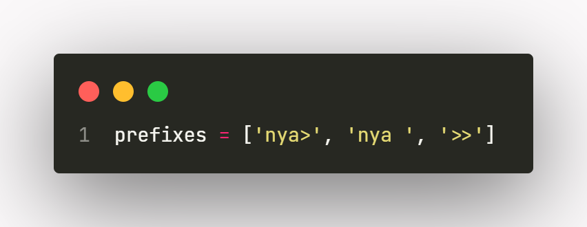
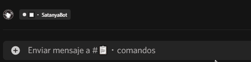
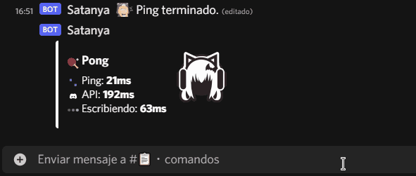
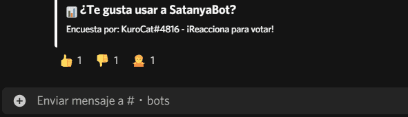
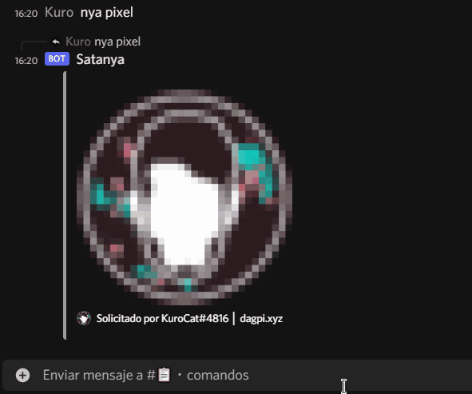
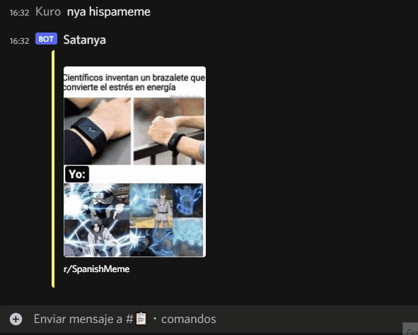
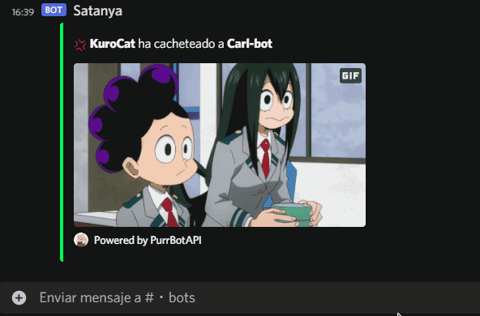

# 🌸 SatanyaBot

> **SatanyaBot es la primer bot de Discord en español y opensource desarrollada en Python.**

SatanyaBot nació con la idea de crear una alternativa de código abierto a los bots en español de Discord como [Chocolat](https://top.gg/bot/379757424447455232), [Nekotina](https://top.gg/bot/429457053791158281), [Ruka](https://top.gg/bot/749462161713266738) y otros.

  

   

## 🎀 Características

### Prefijos

Dentro de servidores y canales:

### Comandos

La cantidad de comandos disponibles de SatanyaBot pueden variar de versión a versión. La lista de categorías muestra solo algunos ejemplos de ellos.

#### Funny

#### General

#### Utils

#### Img

#### Reddit

#### Rol

## 🖥️ APIS
SatanyaBot se sostiene gracias a apis de otros proyectos y bots independientes. La lista de apis cambiará de versión en versión dependiendo si se agregan o eliminan ciertas funcionalidades.
Acá se listan las apis más importantes:

### dagpi.xyz
https://dagpi.xyz/ es la principal api que da funcionalidad a los comandos **img**.

### nekos.life
https://nekos.life/ es una de las principales apis que ofrece funcionalidad a los comandos de **rol**.

### waifu.pics API
https://waifu.pics/docs es una de las apis adicionales que ofrece funcionalidad a los comandos de **rol**.

## 💌 Invita a SatanyaBot
Para poder ver todos los comandos **invita a SatanyaBot a tu servidor haciendo click** [aquí.](https://discord.com/oauth2/authorize?client_id=805589802484760577&scope=bot&permissions=137442610369)
